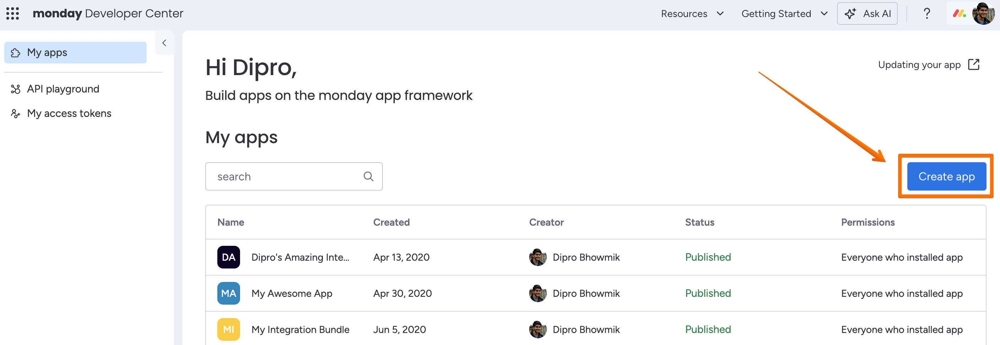
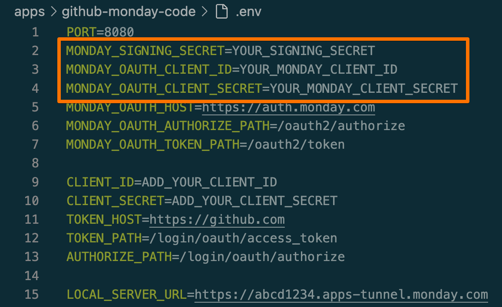

## Overview

## monday setup

The following steps will set up the app in the monday developer center. 

### Clone the project and run the example code

Before starting, run the app in your local environment with these steps: 

1. Clone this repository:
```git clone https://github.com/mondaycom/welcome-apps```
2. Set your working directory to the "Github monday code" sample app: 
```cd apps/github-monday-code```
3. Install the dependencies: `npm install`
4. Start the development server: `npm run dev`
5. The CLI will generate a tunnel URL for you - you'll come back to this later.

### Create an app

To set up the app in Monday, follow these steps:

1. Open monday.com & login to your account. 
2. Open the "Developers" section: Click your avatar menu > Developers
3. Create a new app - "Create app"


### Add an integration feature
1. Open "Features" section and click "Create new". 
2. In the wizard, select the "Integration for Sentence Builder" feature. Click **Next**.
3. Choose the "Github Integration - NodeJS" template to start. Click **Next**. 
4. **Don't run the suggested command.** Instead, open the terminal where you're running the app, and copy your tunnel URL:

5. Paste the tunnel URL (from the command line) into the "URL" box and press create.

### Configure OAuth in Monday

1. Press `OAuth` in the `General` section of the left menu.
2. Enter the `Redirect URLs` tab.
3. Add the following URL: `https://<YOUR_URL>/auth/monday/callback` and **press save**.


### Add monday OAuth info to .env file

1. Open the `Basic Information` tab
2. Copy-paste your app's tunnel URL, client ID, client secret, and signing secret into your app's .env file. 


Congrats, you have successfully set up the app in Monday! 🎉

## Github setup

To integrate with Github, you need to create an OAuth app using your Github account. Follow these steps to set it up:

### Open OAuth apps page in Github
1. Navigate to [github.com](https://github.com/) and login to your github account.
2. Go to the OAuth apps page by clicking on your avatar > Settings > Developer settings > OAuth Apps, or click [here](https://github.com/settings/developers).

### Register a new OAuth app for Github
1. Click the "New OAuth App" button, choose a name for your app, and fill in the details using the tunnel URL obtained from step 1:
   - Name your app something descriptive, such as "Github monday example app"
   - **Homepage URL:** Add your app's Tunnel URL
   - **Authorization Callback URL:** Add the following Authorization Callback URL: "https://<your_tunnel_URL>/auth/github/callback"
   - Leave "Enable device flow" unchecked

2. Click **"Register application"** when done.

### Add Github client ID and secret to .env file
1. After creating the OAuth app, click the "generate a new client secret" button under Client secrets.
2. Copy the Client ID and the newly created Client Secret & paste them in the .env file:
   

   
> Note: `PORT` should be set to `8080`.

3. Save the .env file, and your app is ready to go! You can add one of the recipes to your board and try it out.

## Try the app in your account

1. Open a board in your monday account
2. Click the "Integrate" button at the top of the page
3. Search for your app's feature name – "Github Integration - NodeJS" by default
4. Select a recipe sentence, configure it, and click "Create automation" to create it

## Deploying your app to monday code hosting
1. Connect to your monday account by running `mapps init` and supplying your account's API token. 

2. Run `mapps code:push` to deploy your app. Select the app in your account from options presented. 

3. After deployment, you can use the `code:env` commands in the monday CLI to set the project secrets:
   1. Call secrets command:
      ```bash
      $ mapps code:secret
      ```
    2. Choose the app to set environment variables > set > enter the secret key > then enter the value of the secret. The secret will be injected into process.env of your deployment.

# Happy building! 🎉
